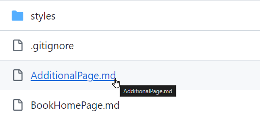

# Activity: Building & Publishing GitBooks
In this activity, turn your lesson plan GitHub repository into a full-fledged student-facing website! Make sure you already have [your own repository](YourOwnRepository.md) before you get started.

### Lesson Plan Template Example
The template from before already has its own live GitBook, built from its source!

- Template Repository: [https://github.com/hylandtechoutreach/lesson-plan-template](https://github.com/hylandtechoutreach/lesson-plan-template)
- Live GitBook: [https://hylandtechoutreach.github.io/lesson-plan-template/](https://hylandtechoutreach.github.io/lesson-plan-template/)

Using this template will make it easy to get your own GitBook up and running quickly.

### GitHub Action Configuration
This process is made possible by the [**.github/workflows/BuildGitBook.yml** file](https://github.com/hylandtechoutreach/lesson-plan-template/blob/main/.github/workflows/BuildGitBook.yml) from the template. That file, with that specific format in that specific location, automatically adds a GitHub Action to the repository. The action:

- runs on every `push` event
- **if** the `main` branch received the push
- grabs the latest code
- runs the `tuliren/publish-gitbook@v1.0.0` action

This is what builds the GitBook site in the `gh-pages` branch. All you have to do is provide the proper settings!

## Step 1: Open Your Repository in GitHub
First, open up your repository from the [previous activity](YourOwnRepository.md) in GitHub on the web.

## Step 2: Update Permissions for GitHub Actions
Next, the GitHub Action workflow needs the proper permissions in order to push the GitBook code to the repository. Follow these steps:

1. Open the Settings of the repository from the top menu  
    
1. On the left, under **Code and automation**, click the **Actions** dropdown
1. Under **Actions**, select the **General** page  
    
1. On that page, scroll down to the **Workflow permissions** section
1. Select the **Read and write permissions** option
1. Click the **Save** button  
    

Now the GitHub Action should be able to run successfully. It's time to test it.

## Step 3: Update the Content
Make a nominal change to the codebase just to see if it's working.

1. Open the **AdditionalPage.md** file from the GitHub Web interface  
    
1. When viewing the file, click the edit button in the upper right  
    
1. In the editor, make a change in the file (like adding "It's cool." at the end)
1. Click the **Commit changes** button in the upper right  
    
1. In the pop-up that appears, click the **Commit changes** button  
    

>_Note: committing the changes through the GitHub Web interface will act as a `push` action to the `main` branch._

Pushing this change will kick off the build process through GitHub Actions! Open the Actions of the repository from the top menu to check on the progress of the action:

Once it completes successfully, all that's left is to make sure GitHub Pages is hooked up to the correct branch.

## Step 4: Update the Source for GitHub Pages
The final step is to set the source for GitHub Pages.

1. Reopen the Settings of the repository from the top menu  
    
1. On the left, under the **Code and automation**, click the **Pages** link  
    
1. In the **Build and deployment** section, under **Branch**, select the **None** dropdown and choose **gh-pages**  
    
1. Click the **Save** button  
    

That's it! Wait for a minute or so, then refresh the page. A box should appear:

Click the link, or the **Visit site** button, to visit your live GitBook!

#### Notes
A couple of notes regarding GitHub Pages:

- With the free version of GitHub, a repository _must_ be public for GitHub Pages to be available
- Creating a simplified URL (e.g., `yourusername.github.io`) is possible by creating a repository with that name

[Click here to read more about GitHub Pages.](https://docs.github.com/en/pages/quickstart)
