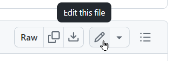
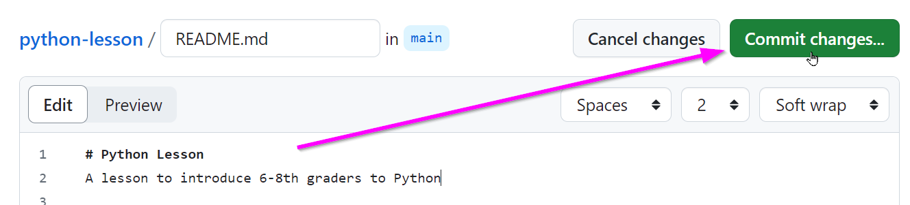
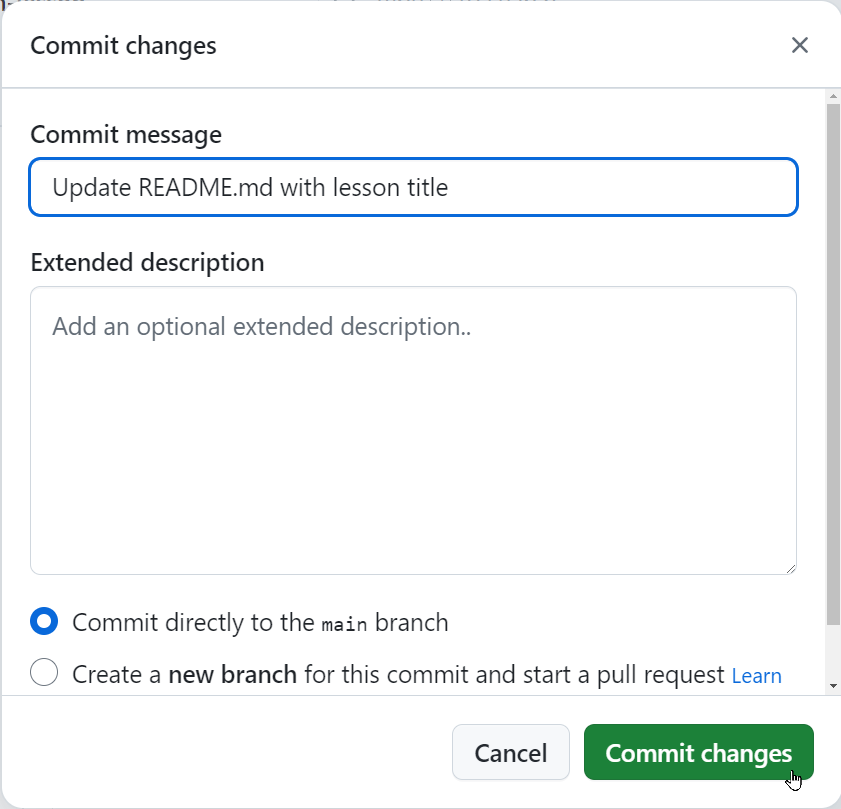

# Activity: Your Own Repository
In this activity, create a GitHub repository to store a lesson plan. _Note: GitHub repositories are well-suited for storing **collections** of lesson plans, but for this activity, we'll store a single one._

## Step 1: Create a GitHub Account
[Click here to sign up for GitHub.](https://github.com/signup) Note than you _must_ verify your email to complete basic GitHub tasks like creating a repository.

>_[more info](https://docs.github.com/en/get-started/start-your-journey/creating-an-account-on-github#signing-up-for-a-new-personal-account)_

## Step 2: Create a Repository
Once you've created a GitHub account and verified your email, [click here to open the Lesson Plan Template repository](https://github.com/hylandtechoutreach/lesson-plan-template). From there:

1. Click the **Use this template** button in the top right corner
1. Select the **Create a new repository** option  
    
1. Select an owner (should be you)
1. Give the repository a name under **Repository name**  
    - For example, "python-lesson"
1. Add a description under **Description**  
    - For example, "A lesson to introduce 6-8th graders to Python"
1. Click the **Create repository** button  
    

That's it - you now have your own lesson plan repository!

## Step 3: Update the Lesson Plan
The next step is to actually write out the lesson plan. For now, just change the **README.md** file so that it has the proper header and introductory blurb.

1. From the repository in GitHub, open the **README.md** file from the file list by clicking on it  
    
1. From the file in GitHub, click the edit button in the upper right  
      
1. For now, change just the top two lines
    - The top line should say something like "Python Lesson"
    - The second line should say something like "A lesson to introduce 6-8th graders to Python"
    - _Note: this file is in markdown format_
1. When complete, click the **Commit changes...** button in the upper right  
    
1. In the pop-up that appears, update the **Commit message** field with some more information
    - Like "Update README.md with lesson title"
1. Click the **Commit changes** button  
    

That's it - you've successfully committed and pushed a change to a GitHub repository!
